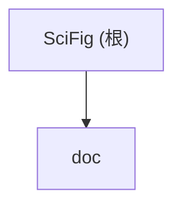

# SciFig

> 变更记录 (Changelog)
> - 2026-04-25 22:44:54 -- 初始生成（项目仅含 LICENSE + 研究文档，无源代码）

## 项目愿景

SciFig 是面向科研人员的开源（MIT）投稿级科研实验图自动化系统。接收真实实验数据（CSV/Excel/矩阵），自动完成数据结构识别、统计流程建议与执行，生成符合顶刊风格（Nature 体系等）与投稿规范的高质量矢量图形（PDF/SVG）及可复现代码。

核心定位：不是"AI 画图"，而是"投稿级科研实验图自动化系统"。

## 架构总览

项目当前处于 **规划/预研阶段**，尚无源代码。`doc/deep-research-report.md` 包含完整的产品研究报告，涵盖竞品分析、顶刊风格规则、图类型最佳实践、统计策略、技术栈建议与 MVP 路线图。

**规划中的技术栈（Python 为主）：**

| 层次 | 库 |
|---|---|
| 数据层 | pandas, NumPy |
| 统计层 | SciPy, statsmodels |
| 可视化层 | matplotlib, seaborn |
| 算法层 | scikit-learn, umap-learn, lifelines |

## 模块结构图

## 模块索引

| 模块路径 | 职责 | 状态 |
|---|---|---|
| `doc/` | 产品研究文档 | 已有深度研究报告 |

## 运行与开发

尚无构建系统、依赖文件或运行脚本。根据研究报告建议，预期未来将使用 Python 环境（`requirements.txt` 或 `pyproject.toml`）。

## 测试策略

尚无测试代码。研究报告建议对风格引擎、数据识别、统计流程进行自动化测试。

## 编码规范

待建立。建议遵循 PEP 8，使用 ruff 作为 linter/formatter。

## AI 使用指引

- 项目的详细产品研究、用户画像、竞品分析、图类型规范、统计策略均在 `doc/deep-research-report.md`
- 顶刊风格硬规则（Nature 体系）：尺寸 89/183mm、字体 5-7pt、线宽 0.25-1pt、禁用网格线/阴影、色盲友好配色、矢量导出与字体嵌入（`pdf.fonttype=42`）
- 首批图型：箱线/小提琴/散点、热图/聚类热图、火山图、PCA、ROC、KM 曲线、相关矩阵、多 panel 拼图
- 统计默认策略：Welch t-test、ANOVA/Kruskal-Wallis、BH-FDR、伪重复检测
