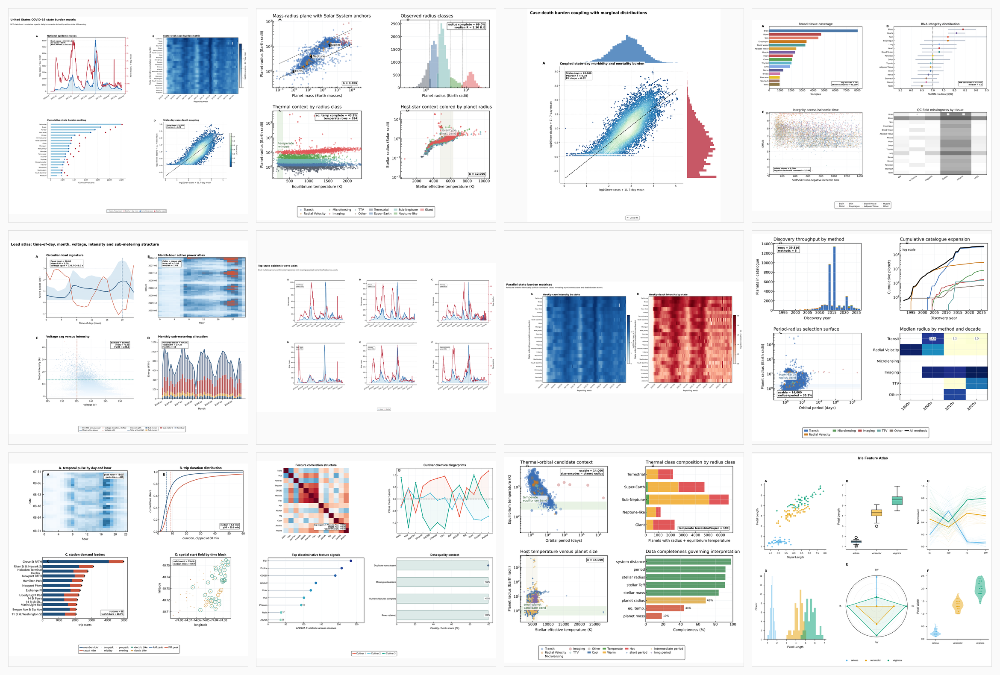
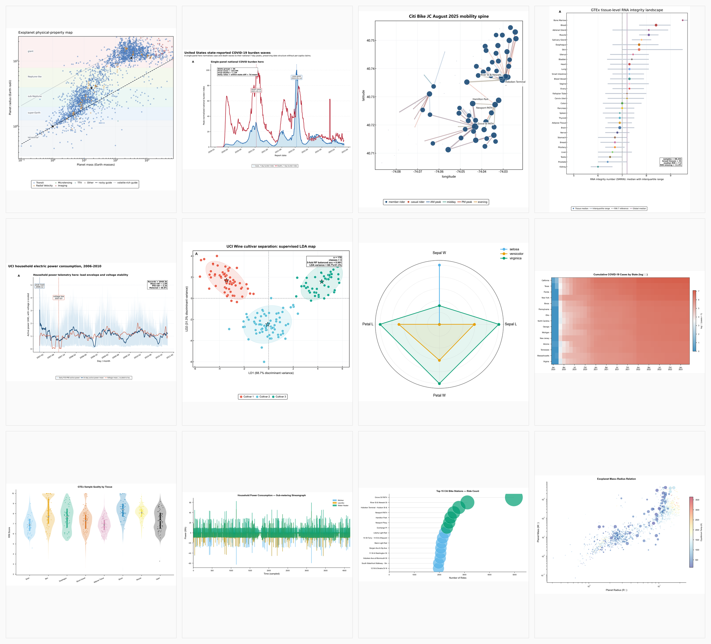

<div align="center">

# SciFig Generate

**Turn experimental data into publication-ready scientific figures — directly inside Claude Code.**

[](LICENSE)
[](https://www.python.org/downloads/)
[](#charts)
[](#journal-styles)

[English](#english) · [中文](#中文) · [Gallery](#gallery) · [Workflow](#workflow) · [Quick Start](#quick-start) · [Python API](#python-api)

</div>

---

<a id="english"></a>

## What It Is

SciFig Generate is a [Claude Code](https://docs.anthropic.com/en/docs/claude-code) skill **and** a pip-installable Python package that transforms experimental data — CSV, TSV, Excel, or matrix files — into submission-ready scientific figures.

- **Skill mode**: drop the skill into Claude Code, mention your data file, and let the four-phase pipeline handle ingestion, chart planning, statistical-test selection, journal-styled code generation, and export.
- **Package mode** (V0.1.3+): `pip install` the `scifig` library and call `scifig.plot(...)` or `scifig.Figure(...).render(...)` directly from your own Python code or CI.

Both modes share the same 121-chart registry, six journal-style profiles (Nature / Cell / Science / Lancet / NEJM / JAMA), zero-touch finalizer (legend contract, layout audit, heatmap label sizing, text-occlusion guards), and SVG / PDF / PNG export with source data, render-QA evidence, and methods-ready statistical reports.

## Changelog

- V0.2.0: PyPI release pipeline (.github/workflows/release.yml), Sphinx docs site (docs/), tag-triggered CI release workflow, README/CHANGELOG refresh.
- V0.1.7: 6 synthetic-but-realistic domain fixtures + 30-case parametrized integration suite + scripts/validate_release.sh 6-gate health check; bug fixes for integer column names and scatter regression numerical safety.
- V0.1.6: scifig.stats multi-group tests (Kruskal-Wallis / ANOVA / Tukey HSD / FDR / recommend_test); scifig.compose layout-recipe loader (12 recipes from layout-recipes-ready.json); 8 common short-name chart aliases; dose_response 4PL Jacobian overflow fix.
- V0.1.5: scifig.polish canonical legend-contract finalizer (single source of truth for the skill's helpers.py finalizer); polar-safe spine handling; figure-relative legend anchor checks.
- V0.1.4: 7 differentiated generator modules (distribution, time_series, matrix, scatter, clinical, genomics, ml) overriding generic_chart fallback; gallery style audit specification.
- V0.1.3: Add pip-installable `scifig` package foundation with Python API, CLI, 121-chart registry, typed contracts, and package-core tests.
- V0.1.2: Add editable SVG output with matching PNG regeneration, plus manual SVG revalidation for adjusted labels and legends.
- V0.1.1: Fix gallery style consistency for centered titles, compact bottom legends, outside panel labels, and ASCII-safe scientific labels.
- V0.1.0: Initial release.

<a id="gallery"></a>

## Gallery

All figures below were generated by SciFig from real open-source datasets across 6 scientific domains. No manual post-processing.

### Multi-Panel Figures



### Single-Panel Hero Figures



<a id="workflow"></a>

## Workflow

SciFig runs as a Claude Code skill. The entire process is triggered inside a Claude Code conversation — no separate server, no API key, no browser tab.

```
User types trigger keyword or /skill scifig-generate
         │
         ▼
  ┌─────────────────────────────────────────────────────────────────┐
  │  SKILL.md — Coordinator                                         │
  │  Validates file path, reads data, dispatches phases             │
  └───────────────────────────┬─────────────────────────────────────┘
                              │
         ┌────────────────────┼────────────────────┐
         ▼                    ▼                    ▼
   Phase 1              Phase 2              Phase 3
   Data Detection        Chart Planning       Code Generation
   ──────────────        ────────────         ────────────────
   • Validate file       • Recommend chart    • Apply journal
     path + encoding       families by          kernel (font,
   • Infer structure       domain + data        size, layout,
     (tidy/wide/           shape                dpi)
     matrix)             • Plan panel         • Generate
   • Detect domain         blueprint            matplotlib code
     (13 scientific      • Select             • Run finalizer
     domains)              statistical          (3 auto-correct
   • Build dataProfile     tests                passes)
   • Collect             • Build palette      • Layout audit
     preferences           plan               • Legend contract
   • Return:             • Return:            • Return:
     dataProfile           chartPlan            styledCode
         │                    │                    │
         └────────────────────┼────────────────────┘
                              ▼
                        Phase 4
                        Export & Report
                        ────────────────
                        • Export SVG/PDF
                        • Generate source data tables
                        • Render QA evidence
                        • Write methods-ready stats report
                        • Output reproducible code snapshot
                        • Return: outputBundle
```

<a id="quick-start"></a>

### How It Works in Practice (Skill Mode)

**Step 1 — Install**

```bash
git clone https://github.com/Techd81/SciFig.git
cp -r SciFig/.claude/skills/scifig-generate ~/.claude/skills/
```

Restart Claude Code. The skill is auto-discovered.

**Step 2 — Trigger**

In any Claude Code conversation, mention your data file. Trigger keywords: `generate figure`, `plot data`, `sci figure`, `科研图`, `画图`, `多 panel`. Or use the explicit command:

```
> /skill scifig-generate
> FILE: /path/to/your_data.csv
> EXTRAS: I want a hero panel showing biomarker levels over time
```

**Step 3 — Automatic Pipeline**

SciFig takes over from here:

1. **Data Detection** — Reads your file, infers column types, detects the scientific domain, builds a `dataProfile`
2. **Chart Planning** — Recommends chart families (121 types across 13 domains), selects statistical tests, plans panels and palette
3. **Code Generation** — Applies the journal style kernel (Nature / Cell / Science / Lancet / NEJM / JAMA), generates matplotlib code, runs the zero-touch finalizer
4. **Export** — Outputs SVG + PDF figures, source data tables, render QA evidence, stats report, and reproducible code

**Step 4 — Receive Output**

```
output/
├── figures/             # SVG + PDF, vector-only, journal-standard dimensions
├── source_data/         # Excel-ready per-panel tables
├── render_qa/           # Layout audit, contract enforcement, overlap report
├── stats_report.md      # Methods-section-ready test descriptions
├── code/                # Reproducible generator script + helpers snapshot
└── metadata.json        # Provenance, seed, journal profile, palette
```

### What Makes SciFig Different

| Aspect | Traditional workflow | SciFig |
|---|---|---|
| Tool | Python scripts, seaborn docs, Stack Overflow | One Claude Code skill or `pip install scifig`, natural language trigger |
| Chart choice | Browse examples, guess | Auto-recommend by domain + data shape (121 types) |
| Journal style | Hand-tune rcParams per journal | One token swap (`style="nature"` → `"cell"`) |
| Statistics | "Just use a t-test" | Auto-select by data shape; refuse unsupported claims |
| Layout | Manual GridSpec per figure | 11 registry-backed layout recipes + narrative arcs |
| Color | Rainbow palette | Wong / Okabe-Ito defaults, colorblind-safe, cross-panel consistent |
| QA | Render → eyeball → hope | Geometric overlap audit + 3-pass finalizer + render QA |
| Manual fixes | Drag labels after exporting, then lose reproducibility | Editable SVG is the canonical source; PNG is regenerated from it |
| CJK | Missing glyph warnings, boxes | Runtime-filtered fallback chain, zero warnings |

<a id="python-api"></a>

## Python API (V0.1.3+)

The `scifig` package gives you the same 121-chart registry, six journal styles, and finalizer pipeline outside of Claude Code — usable from any Python script, notebook, or CI job.

### Install

```bash
# From a clone of the repo (editable for development)
pip install -e .

# Or once published to PyPI
pip install scifig
```

Verify:

```bash
scifig --help
scifig list-charts
```

### Fluent API — `scifig.plot()`

One call, one figure:

```python
import scifig

fig = scifig.plot(
    "data.csv",
    chart="volcano",        # or "auto" to let SciFig decide from the data shape
    style="nature",          # "nature" | "cell" | "science" | "lancet" | "nejm" | "jama"
    palette="colorblind",    # Wong palette by default
    stats="strict",          # "strict" | "standard" | "descriptive" | "none"
    output="figs/volcano.svg",  # writes SVG + companion metadata.json + requirements.txt
    dpi=300,
)
```

`scifig.plot()` accepts a CSV / TSV / XLSX / XLS path **or** a `pandas.DataFrame`. When `output` is `None`, it returns a `matplotlib.figure.Figure` so you can keep customizing.

### Builder API — `scifig.Figure`

For multi-panel composition:

```python
from scifig import Figure

result_path = (
    Figure(style="cell", palette="colorblind")
    .add_panel(chart="volcano", data="rnaseq.csv", position=(0, 0))
    .add_panel(chart="box_strip", data="qpcr.csv", position=(0, 1))
    .add_panel(chart="km", data="survival.csv", position=(1, 0))
    .add_panel(chart="forest", data="meta_analysis.csv", position=(1, 1))
    .compose(recipe="storyboard_2x2")
    .render(output="figs/figure_2.pdf", dpi=300)
)
```

The builder collects per-axis legend handles into a single shared `fig.legend` at bottom-center — the same contract the finalizer enforces in skill mode.

### Registry Inspection

```python
import scifig

scifig.list_charts()              # → ['adjacency_matrix', 'alluvial', ..., 'xrd_pattern']  (121 keys)
scifig.get_chart_info("ridgeline")
# → {'key': 'ridge', 'family': 'distribution', 'category': 'Distribution', 'description': 'Ridge'}

# Plug in your own generator if you need a custom chart
@scifig.register_chart("my_custom_volcano")
def _my_volcano(df, data_profile, chart_plan, rc_params, palette, col_map=None, ax=None):
    ...
    return ax
```

### CLI

```bash
# Auto-pick chart and write a Nature-styled SVG
scifig plot data.csv --chart auto --style nature -o fig.svg

# Force a specific chart, palette, statistical mode, and TIFF export
scifig plot data.csv --chart volcano --style cell --palette okabe-ito --stats strict -o fig.tiff

# List the registry
scifig list-charts
```

The CLI exits with `0` on success, `1` on user-facing errors (missing file, unknown chart / style), `2` on rendering failures.

### Skill ↔ Package Relationship

| Layer | What it is | When to use |
|---|---|---|
| `.claude/skills/scifig-generate/` | Coordinator + phase docs + helpers + template-mining knowledge base | Inside Claude Code conversations: full preference collection, agent delegation, render-QA loop |
| `src/scifig/` (the `scifig` package) | Pure Python library: API, CLI, registry, journal styles, ingest, stats, export | Outside Claude Code: notebooks, scripts, CI/CD, batch pipelines |

The package re-uses the skill's chart taxonomy and journal-profile tokens. The skill calls into the package when the runtime is available.

## Features

### Charts — 121 Types

| Family | Count | Examples |
|---|---|---|
| Distribution | 14 | `violin_strip`, `raincloud`, `beeswarm`, `ridge`, `ecdf` |
| Time series | 11 | `line_ci`, `spaghetti`, `area_stacked`, `streamgraph`, `gantt` |
| Matrix / heatmap | 11 | `heatmap_cluster`, `heatmap_triangular`, `confusion_matrix`, `dotplot` |
| Scatter / embedding | 10 | `pca`, `umap`, `tsne`, `scatter_regression`, `bland_altman` |
| Statistical diagnostic | 8 | `residual_vs_fitted`, `cook_distance`, `qq`, `leverage_plot` |
| Clinical / survival | 12 | `km`, `forest`, `waterfall`, `swimmer_plot`, `nomogram` |
| Genomics enrichment | 10 | `volcano`, `ma_plot`, `manhattan`, `oncoprint`, `kegg_bar` |
| ML diagnostic | 9 | `roc`, `pr_curve`, `calibration`, `training_curve` |
| Engineering / spectra | 6 | `stress_strain`, `phase_diagram`, `nyquist_plot`, `xrd_pattern` |
| Composition / flow | 12 | `sankey`, `alluvial`, `treemap`, `sunburst`, `chord_diagram` |
| Ecology / environment | 4 | `species_abundance`, `shannon_diversity`, `ordination_plot` |
| Psychology / social | 4 | `likert_divergent`, `likert_stacked`, `mediation_path` |
| Misc / hybrid | 10 | `dumbbell`, `paired_lines`, `dose_response`, `mosaic_plot` |

Full registry: [`phases/code-gen/registry.py`](.claude/skills/scifig-generate/phases/code-gen/registry.py).

<a id="journal-styles"></a>

### Journal Styles

| Style | Token | Single column | Double column | Typography |
|---|---|---|---|---|
| **Nature** | `style="nature"` | 89 mm | 183 mm | Times New Roman body, 6.5 pt, spine-out ticks |
| **Cell** | `style="cell"` | 85 mm | 174 mm | Denser type, story-board layouts |
| **Science** | `style="science"` | 90 mm | 190 mm | Minimal axes, narrative-first |
| **Lancet** | `style="lancet"` | 84 mm | 174 mm | Clinical conservatism, muted accents |
| **NEJM** | `style="nejm"` | 88 mm | 171 mm | Table-grade hygiene, generous whitespace |
| **JAMA** | `style="jama"` | 89 mm | 183 mm | JAMA Network typography |

### Zero-Touch Finalizer

Three corrective passes run automatically before layout audit — generators don't call these explicitly:

| Pass | What it fixes |
|---|---|
| `_promote_inaxes_text_safety` | Lifts in-axes text to `zorder≥20` + white bbox so labels aren't buried under data |
| `_shrink_heatmap_cell_labels` | Reformats heatmap cell text to fit physical cell width |
| Layout audit | Reports text-vs-line / text-vs-scatter / text-vs-patch overlap > 30% |

Legend contract: exactly one shared bottom-center `fig.legend` per figure. Outside-right legends and in-axes `loc="best"` are forbidden by policy and enforced by `source-lint.py`.

### CJK Font Fallback

Runtime-filtered fallback chain: `DejaVu Sans → Arial → Helvetica → Microsoft YaHei → SimHei → Noto Sans CJK SC → Noto Sans CJK JP → Hiragino Sans`. Only installed families survive. Zero `findfont` warnings.

## Architecture

```
SciFig/
├── .claude/skills/scifig-generate/        # Claude Code skill (skill mode)
│   ├── SKILL.md                           # Coordinator: gates, agent policy, phase dispatch
│   ├── phases/
│   │   ├── 01-data-detect.md              # Phase 1: ingest, semantic roles, domain inference
│   │   ├── 02-recommend-stats.md          # Phase 2: chart taxonomy, stats, panel blueprint
│   │   ├── 03-code-gen-style.md           # Phase 3: journal profiles, palette, code generation
│   │   ├── 04-export-report.md            # Phase 4: export bundle, source data, metadata
│   │   ├── 05-template-distill.md         # Optional article-code extraction
│   │   └── code-gen/
│   │       ├── helpers.py                 # Finalizer, contracts, layout audit
│   │       ├── template_mining_helpers.py # Kernel, palette, idioms
│   │       ├── registry.py                # 121 chart key → generator function map
│   │       ├── source-lint.py             # Forbidden-pattern lint (skill + package)
│   │       └── generators-*.py            # Domain-grouped generator implementations
│   ├── specs/                             # Chart catalog, domain playbooks, journal profiles
│   ├── template-mining/                   # 7-module visual grammar knowledge base (77 cases)
│   └── templates/                         # Runtime resources: palette, layout, zorder registries
├── src/scifig/                            # Pip-installable Python package (V0.1.3+)
│   ├── api.py                             # scifig.plot() fluent API
│   ├── figure.py                          # scifig.Figure builder API
│   ├── charts.py                          # Generator dispatch
│   ├── registry.py                        # 121-chart registry shared with skill
│   ├── styles.py                          # 6 journal-profile rcParams kernels
│   ├── palettes.py                        # Wong, Okabe-Ito, viridis, RdBu
│   ├── ingest.py                          # File/DataFrame loading + role inference
│   ├── stats.py                           # Statistical guardrails
│   ├── export.py                          # SVG/PDF/TIFF/PNG writer + sidecar metadata
│   ├── cli.py                             # `scifig` console-script entry point
│   └── types.py                           # Typed contracts (DataProfile, ChartPlan, ...)
└── tests/                                 # pytest suite (skill + package)
```

## Contributing

Issues and PRs welcome.

## License

MIT — see [LICENSE](LICENSE). Copyright (c) 2026 Techd.

## Acknowledgements

- 77 reference cases extracted from open Nature / Cell / Science / Lancet / NEJM / JAMA figures.
- Color systems credit Bang Wong (Nature Methods 2011) and Masataka Okabe / Kei Ito (J*FLY* 2008).
- Built as a [Claude Code](https://docs.anthropic.com/en/docs/claude-code) skill.

---

<a id="中文"></a>

<details>
<summary><b>中文版</b>（点击展开）</summary>

# SciFig Generate

**在 Claude Code 中把实验数据一步转换为投稿级科研图。**

## 项目简介

SciFig Generate 是一个 [Claude Code](https://docs.anthropic.com/en/docs/claude-code) 技能**和**一个可 pip 安装的 Python 包，可将实验数据（CSV、TSV、Excel 或矩阵文件）转换为投稿级科研图。

- **技能模式**：把技能放进 Claude Code，对话中提到数据文件即可，由四阶段流水线自动完成数据读取、图表规划、统计检验选择、期刊样式代码生成与导出。
- **包模式**（V0.1.3+）：`pip install` 后直接在自己的 Python 代码或 CI 中调用 `scifig.plot(...)` 或 `scifig.Figure(...).render(...)`。

两种模式共用同一套 121 种图表注册表、6 种期刊样式（Nature / Cell / Science / Lancet / NEJM / JAMA）、零接触 finalizer（图例合约、布局审计、热图标签自适配、文本遮挡守卫），以及 SVG / PDF / PNG 导出，附带源数据、渲染 QA 证据和方法学就绪的统计报告。

## 更新日志

- V0.1.3：新增可 `pip` 安装的 `scifig` package 基础能力，包括 Python API、CLI、121 图表注册表、类型契约和 package-core 测试。
- V0.1.2：新增可编辑 SVG 输出，并从 SVG 重新生成一致的 PNG；支持用户手动调整标签和图例后重新验证导出。
- V0.1.1：修复图库样式一致性问题，包括标题居中、底部图例紧凑排布、面板标签移到轴外，以及科学标签使用 ASCII 安全文本。
- V0.1.0：首次发布。

## 图库

以下所有图均由 SciFig 使用真实开源数据集自动生成，无任何手工后处理。

### 多 Panel 图


### 单 Panel Hero 图


## 工作流程

SciFig 作为 Claude Code 技能运行，整个流程在 Claude Code 对话中触发——不需要单独的服务器、API 密钥或浏览器标签页。

```
用户输入触发关键词或 /skill scifig-generate
         │
         ▼
  ┌───────────────────────────────────────────────────┐
  │  SKILL.md — 协调器                                  │
  │  验证文件路径、读取数据、分派各阶段                     │
  └─────────────────────┬─────────────────────────────┘
                        │
       ┌────────────────┼────────────────┐
       ▼                ▼                ▼
  阶段 1            阶段 2            阶段 3
  数据检测           图表规划           代码生成
  ────────          ────────          ────────
  • 验证文件路径     • 按领域和数据     • 应用期刊样式
    和编码            形态推荐图表       内核（字体、
  • 推断数据结构       家族（121 种       尺寸、布局、
    （tidy/wide/       图表，13 个        DPI）
    matrix）           领域）           • 生成 matplotlib
  • 检测科学领域     • 规划 panel         代码
    （13 个领域）      布局蓝图         • 运行 finalizer
  • 构建 dataProfile • 选择统计检验     • 布局审计
  • 收集偏好         • 构建调色板方案   • 图例合约
  • 输出：           • 输出：           • 输出：
    dataProfile       chartPlan         styledCode
       │                │                │
       └────────────────┼────────────────┘
                        ▼
                  阶段 4
                  导出与报告
                  ────────
                  • 导出 SVG/PDF
                  • 生成源数据表格
                  • 渲染 QA 证据
                  • 撰写统计报告
                  • 输出可复现代码快照
                  • 输出：outputBundle
```

### 实际使用步骤（技能模式）

**第 1 步 — 安装**

```bash
git clone https://github.com/Techd81/SciFig.git
cp -r SciFig/.claude/skills/scifig-generate ~/.claude/skills/
```

重启 Claude Code，技能自动被发现。

**第 2 步 — 触发**

在任意 Claude Code 对话中提及你的数据文件。触发关键词：`生成图表`、`画图`、`科研图`、`多 panel`、`generate figure`、`plot data`。或使用显式命令：

```
> /skill scifig-generate
> FILE: /path/to/your_data.csv
> EXTRAS: 我想要一个 hero panel 显示生物标志物随时间的变化
```

**第 3 步 — 自动流水线**

SciFig 自动执行：

1. **数据检测** — 读取文件、推断列类型、检测科学领域、构建 `dataProfile`
2. **图表规划** — 推荐图表家族（13 个领域 121 种）、选择统计检验、规划面板和调色板
3. **代码生成** — 应用期刊样式内核（Nature / Cell / Science / Lancet / NEJM / JAMA）、生成 matplotlib 代码、运行 zero-touch finalizer
4. **导出** — 输出 SVG + PDF 图、源数据表、渲染 QA 证据、统计报告、可复现代码

**第 4 步 — 获得输出**

```
output/
├── figures/             # SVG + PDF，纯矢量，期刊标准尺寸
├── source_data/         # 每个 panel 的 Excel-ready 表格
├── render_qa/           # 布局审计 + 合约执行 + 重叠报告
├── stats_report.md      # 论文方法学就绪的统计描述
├── code/                # 可复现生成脚本 + helpers 快照
└── metadata.json        # 来源、随机种子、期刊配置、调色板
```

### SciFig 与传统方式的区别

| 方面 | 传统方式 | SciFig |
|---|---|---|
| 工具 | Python 脚本、seaborn 文档、Stack Overflow | 一个 Claude Code 技能或 `pip install scifig`，自然语言触发 |
| 图表选择 | 翻文档、靠猜 | 按领域 + 数据形态自动推荐（121 种） |
| 期刊样式 | 每次投稿手工调 rcParams | 一个 token 切换（`style="nature"` → `"cell"`） |
| 统计 | "随便加一个 t 检验" | 按数据形态自动选检验，拒绝不支持的推断 |
| 排版 | 每图手写 GridSpec | 11 种 layout 配方 + 叙事弧 |
| 配色 | 彩虹色 | Wong / Okabe-Ito 默认，色盲安全，跨 panel 一致 |
| 质检 | 渲染 → 肉眼看 → 希望 | 几何重叠审计 + 3 pass finalizer + 渲染 QA |
| 中文 | 缺字形警告、方块字 | 运行时过滤回退链，零警告 |

## Python API（V0.1.3+）

`scifig` 包让你在 Claude Code 之外也能使用同一套 121 图表注册表、6 种期刊样式和 finalizer 流水线——可在任意 Python 脚本、notebook 或 CI 任务中使用。

### 安装

```bash
# 从仓库 clone 后开发模式安装
pip install -e .

# 或发布到 PyPI 后
pip install scifig
```

验证：

```bash
scifig --help
scifig list-charts
```

### Fluent API — `scifig.plot()`

一行调用，一张图：

```python
import scifig

fig = scifig.plot(
    "data.csv",
    chart="volcano",        # 或 "auto" 让 SciFig 根据数据形态自动决定
    style="nature",          # "nature" | "cell" | "science" | "lancet" | "nejm" | "jama"
    palette="colorblind",    # 默认 Wong 色板
    stats="strict",          # "strict" | "standard" | "descriptive" | "none"
    output="figs/volcano.svg",  # 写出 SVG + 配套 metadata.json + requirements.txt
    dpi=300,
)
```

`scifig.plot()` 接受 CSV / TSV / XLSX / XLS 路径**或** `pandas.DataFrame`。当 `output` 为 `None` 时，返回 `matplotlib.figure.Figure` 供你继续自定义。

### Builder API — `scifig.Figure`

用于多 panel 组合：

```python
from scifig import Figure

result_path = (
    Figure(style="cell", palette="colorblind")
    .add_panel(chart="volcano", data="rnaseq.csv", position=(0, 0))
    .add_panel(chart="box_strip", data="qpcr.csv", position=(0, 1))
    .add_panel(chart="km", data="survival.csv", position=(1, 0))
    .add_panel(chart="forest", data="meta_analysis.csv", position=(1, 1))
    .compose(recipe="storyboard_2x2")
    .render(output="figs/figure_2.pdf", dpi=300)
)
```

Builder 会把每个 axis 的 legend handle 收集到一个共享的 bottom-center `fig.legend`——与技能模式下 finalizer 强制的合约一致。

### 注册表查询

```python
import scifig

scifig.list_charts()              # → ['adjacency_matrix', 'alluvial', ..., 'xrd_pattern']  （121 个 key）
scifig.get_chart_info("ridgeline")
# → {'key': 'ridge', 'family': 'distribution', 'category': 'Distribution', 'description': 'Ridge'}

# 需要自定义图表时，注入自己的 generator
@scifig.register_chart("my_custom_volcano")
def _my_volcano(df, data_profile, chart_plan, rc_params, palette, col_map=None, ax=None):
    ...
    return ax
```

### CLI

```bash
# 自动选图表，输出 Nature 样式 SVG
scifig plot data.csv --chart auto --style nature -o fig.svg

# 指定图表、调色板、统计模式，导出 TIFF
scifig plot data.csv --chart volcano --style cell --palette okabe-ito --stats strict -o fig.tiff

# 列出注册表
scifig list-charts
```

CLI 退出码：成功 `0`，用户面错误（缺文件、未知图表/样式）`1`，渲染失败 `2`。

### 技能模式 ↔ 包模式 关系

| 层 | 是什么 | 何时使用 |
|---|---|---|
| `.claude/skills/scifig-generate/` | 协调器 + 各阶段文档 + helpers + 模板挖掘知识库 | Claude Code 对话中：完整的偏好收集、Agent 分派、渲染 QA 闭环 |
| `src/scifig/`（`scifig` 包） | 纯 Python 库：API、CLI、注册表、期刊样式、ingest、stats、export | Claude Code 之外：notebook、脚本、CI/CD、批量流水线 |

包复用了技能的图表分类法和期刊样式 token。当运行时可用时，技能会调用包。

## 核心特性

### 图表 — 121 种

| 家族 | 数量 | 示例 |
|---|---|---|
| 分布 | 14 | `violin_strip`、`raincloud`、`beeswarm`、`ridge`、`ecdf` |
| 时间序列 | 11 | `line_ci`、`spaghetti`、`area_stacked`、`streamgraph`、`gantt` |
| 矩阵 / 热图 | 11 | `heatmap_cluster`、`heatmap_triangular`、`confusion_matrix`、`dotplot` |
| 散点 / 嵌入 | 10 | `pca`、`umap`、`tsne`、`scatter_regression`、`bland_altman` |
| 统计诊断 | 8 | `residual_vs_fitted`、`cook_distance`、`qq`、`leverage_plot` |
| 临床 / 生存 | 12 | `km`、`forest`、`waterfall`、`swimmer_plot`、`nomogram` |
| 基因组富集 | 10 | `volcano`、`ma_plot`、`manhattan`、`oncoprint`、`kegg_bar` |
| 机器学习诊断 | 9 | `roc`、`pr_curve`、`calibration`、`training_curve` |
| 工程 / 谱学 | 6 | `stress_strain`、`phase_diagram`、`nyquist_plot`、`xrd_pattern` |
| 组成 / 流图 | 12 | `sankey`、`alluvial`、`treemap`、`sunburst`、`chord_diagram` |
| 生态 / 环境 | 4 | `species_abundance`、`shannon_diversity`、`ordination_plot` |
| 心理 / 社会 | 4 | `likert_divergent`、`likert_stacked`、`mediation_path` |
| 杂项 / 复合 | 10 | `dumbbell`、`paired_lines`、`dose_response`、`mosaic_plot` |

完整注册表：[`phases/code-gen/registry.py`](.claude/skills/scifig-generate/phases/code-gen/registry.py)。

### 期刊样式

| 样式 | Token | 单栏 | 双栏 | 排版 |
|---|---|---|---|---|
| **Nature** | `style="nature"` | 89 mm | 183 mm | Times New Roman 正文，6.5 pt，spine-out 刻度 |
| **Cell** | `style="cell"` | 85 mm | 174 mm | 字体更密，故事板布局 |
| **Science** | `style="science"` | 90 mm | 190 mm | 极简坐标轴，叙事优先 |
| **Lancet** | `style="lancet"` | 84 mm | 174 mm | 临床保守，柔和强调 |
| **NEJM** | `style="nejm"` | 88 mm | 171 mm | 表格级清洁，留白充足 |
| **JAMA** | `style="jama"` | 89 mm | 183 mm | JAMA Network 排版 |

### 零接触 Finalizer

3 个矫正 pass 在布局审计前自动执行——generator 不显式调用：

| Pass | 修复内容 |
|---|---|
| `_promote_inaxes_text_safety` | 把轴内文本提升到 `zorder≥20` + 白底 bbox，使标签不被数据掩埋 |
| `_shrink_heatmap_cell_labels` | 重新格式化热图 cell 文本以适配物理 cell 宽度 |
| 布局审计 | 报告文本 vs 线 / 散点 / 色块的重叠 > 30% |

图例合约：每张图恰好一个共享的 bottom-center `fig.legend`。外置右侧图例和轴内 `loc="best"` 由策略禁止，并由 `source-lint.py` 强制执行。

### 中文字体回退

运行时过滤回退链：`DejaVu Sans → Arial → Helvetica → Microsoft YaHei → SimHei → Noto Sans CJK SC → Noto Sans CJK JP → Hiragino Sans`。仅保留已安装的字族。零 `findfont` 警告。

## 架构

```
SciFig/
├── .claude/skills/scifig-generate/        # Claude Code 技能（技能模式）
│   ├── SKILL.md                           # 协调器：闸门、Agent 策略、阶段分派
│   ├── phases/
│   │   ├── 01-data-detect.md              # 阶段 1：读取、语义角色、领域推断
│   │   ├── 02-recommend-stats.md          # 阶段 2：图表分类法、统计、面板蓝图
│   │   ├── 03-code-gen-style.md           # 阶段 3：期刊样式、调色板、代码生成
│   │   ├── 04-export-report.md            # 阶段 4：导出 bundle、源数据、metadata
│   │   ├── 05-template-distill.md         # 可选：article-code 抽取
│   │   └── code-gen/
│   │       ├── helpers.py                 # Finalizer、合约、布局审计
│   │       ├── template_mining_helpers.py # Kernel、调色板、idiom
│   │       ├── registry.py                # 121 图表 key → generator 函数映射
│   │       ├── source-lint.py             # 禁用模式 lint（技能 + 包）
│   │       └── generators-*.py            # 按领域分组的 generator 实现
│   ├── specs/                             # 图表目录、领域 playbook、期刊样式
│   ├── template-mining/                   # 7 模块视觉语法知识库（77 案例）
│   └── templates/                         # 运行时资源：palette、layout、zorder 注册表
├── src/scifig/                            # 可 pip 安装的 Python 包（V0.1.3+）
│   ├── api.py                             # scifig.plot() Fluent API
│   ├── figure.py                          # scifig.Figure Builder API
│   ├── charts.py                          # Generator 分派
│   ├── registry.py                        # 与技能共享的 121 图表注册表
│   ├── styles.py                          # 6 种期刊样式 rcParams kernel
│   ├── palettes.py                        # Wong、Okabe-Ito、viridis、RdBu
│   ├── ingest.py                          # 文件 / DataFrame 加载 + 角色推断
│   ├── stats.py                           # 统计守卫
│   ├── export.py                          # SVG/PDF/TIFF/PNG 写出 + 配套 metadata
│   ├── cli.py                             # `scifig` console-script 入口
│   └── types.py                           # 类型契约（DataProfile、ChartPlan 等）
└── tests/                                 # pytest 套件（技能 + 包）
```

## 贡献

欢迎 Issue 与 PR。

## 许可

MIT，详见 [LICENSE](LICENSE)。版权 (c) 2026 Techd。

## 致谢

- 77 个参考案例提取自开放的 Nature / Cell / Science / Lancet / NEJM / JAMA 图。
- 配色系统来自 Bang Wong（Nature Methods 2011）与 Masataka Okabe / Kei Ito（J*FLY* 2008）。
- 作为 [Claude Code](https://docs.anthropic.com/en/docs/claude-code) 技能构建。

</details>
