<div align="center">

# SciFig Generate

**Turn experimental data into publication-ready scientific figures — directly inside Claude Code.**

[](LICENSE)
[](https://www.python.org/downloads/)
[](#charts)
[](#journal-styles)

[English](#english) · [中文](#中文) · [Gallery](#gallery) · [Workflow](#workflow) · [Quick Start](#quick-start)

</div>

---

<a id="english"></a>

## What It Is

SciFig Generate is a [Claude Code](https://docs.anthropic.com/en/docs/claude-code) skill that transforms your experimental data — CSV, TSV, Excel, or matrix files — into submission-ready scientific figures through a fully automated four-phase pipeline.

Upload your data. SciFig validates the file path, infers data structure and scientific domain, recommends chart families and statistical tests, generates Nature / Cell / Science / Lancet / NEJM / JAMA-aligned matplotlib code, runs zero-touch finalizer passes (legend contract, layout audit, heatmap label sizing, text-occlusion guards), and exports SVG / PDF figures with source data, render-QA evidence, and a methods-ready statistical report.

## Changelog

- V0.1.0: Initial release.

<a id="gallery"></a>

## Gallery

All figures below were generated by SciFig from real open-source datasets across 6 scientific domains. No manual post-processing.

### Multi-Panel Figures

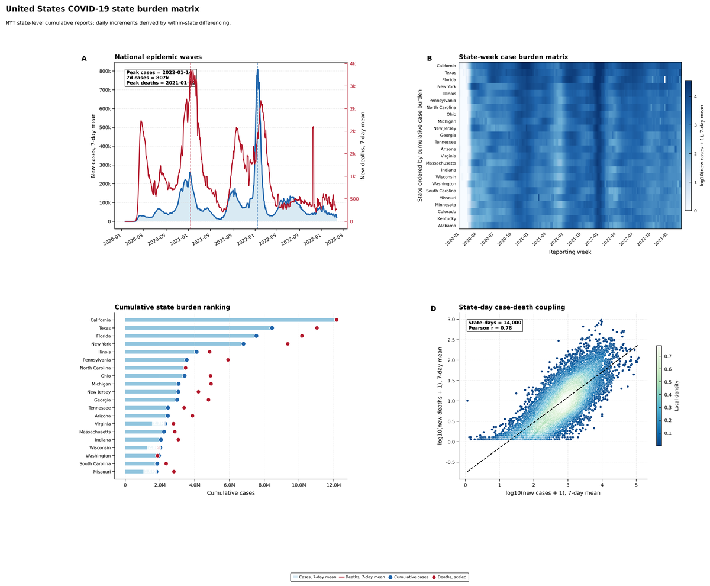
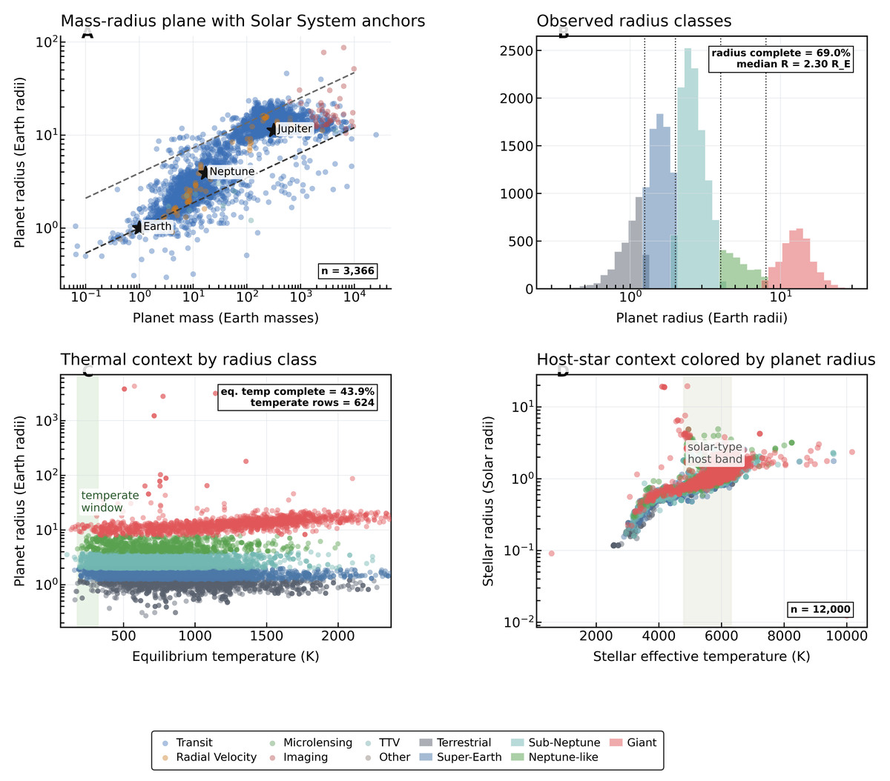
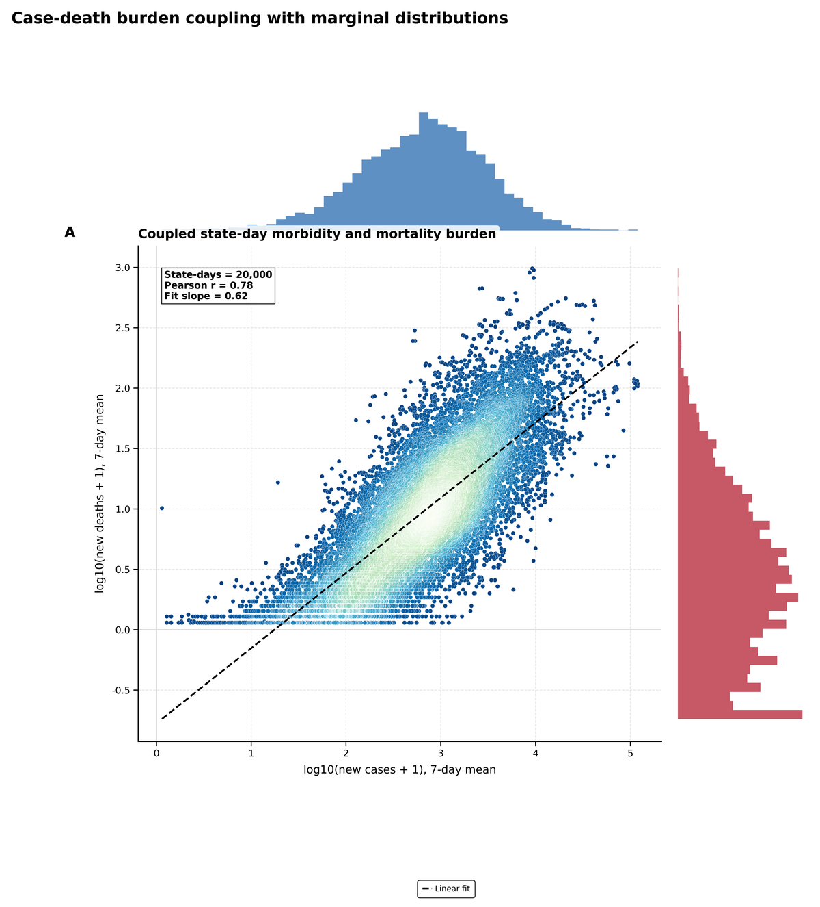
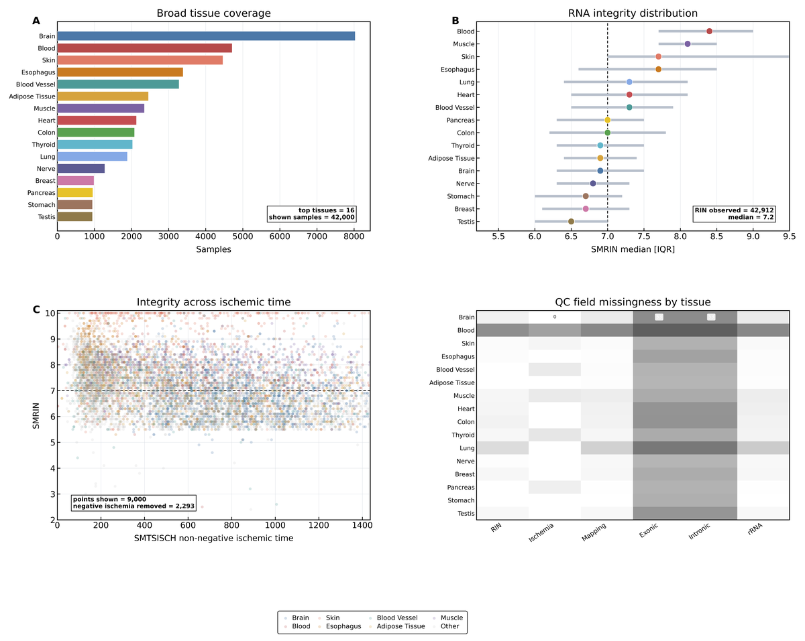

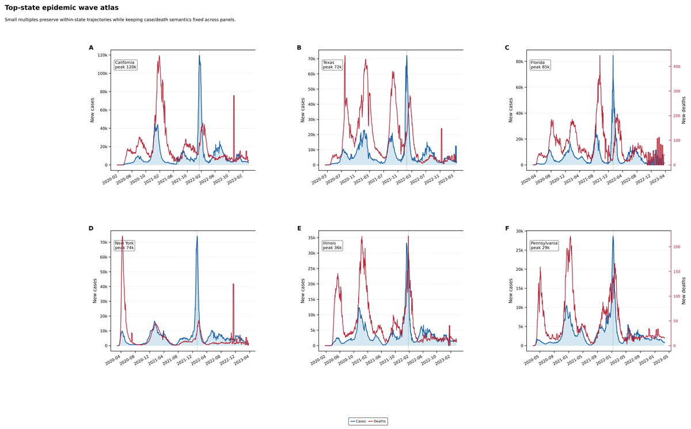
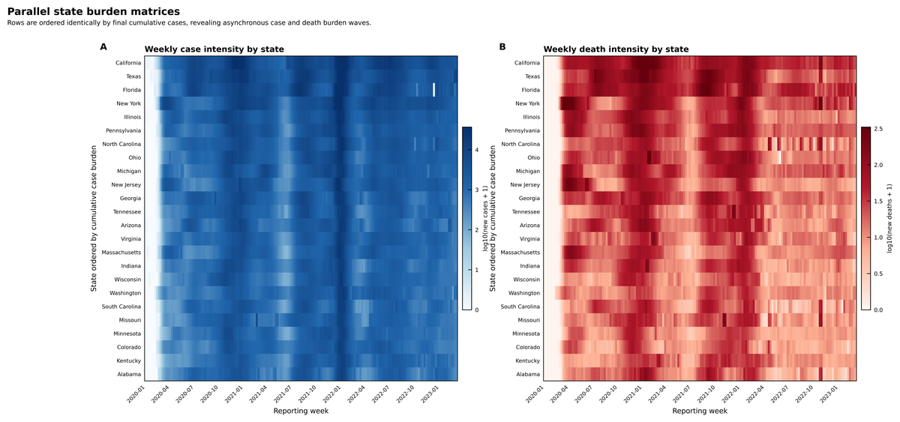
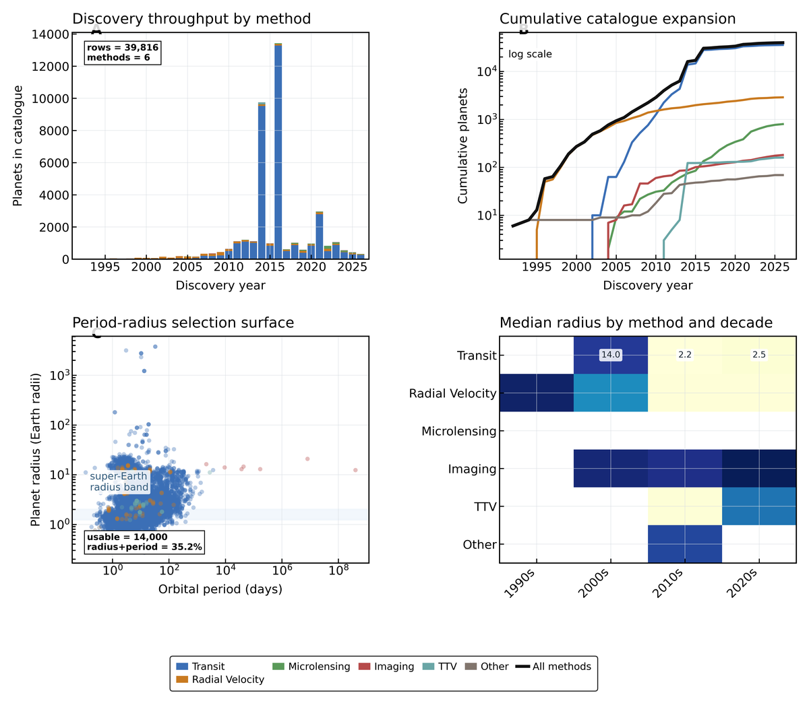
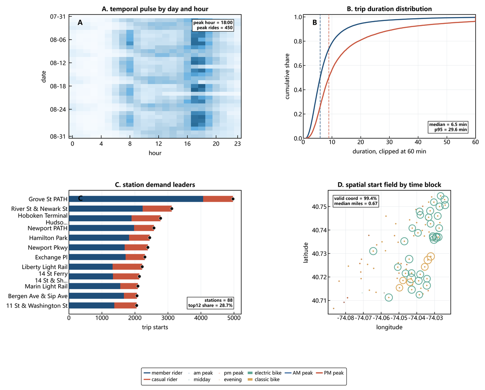


### Single-Panel Hero Figures

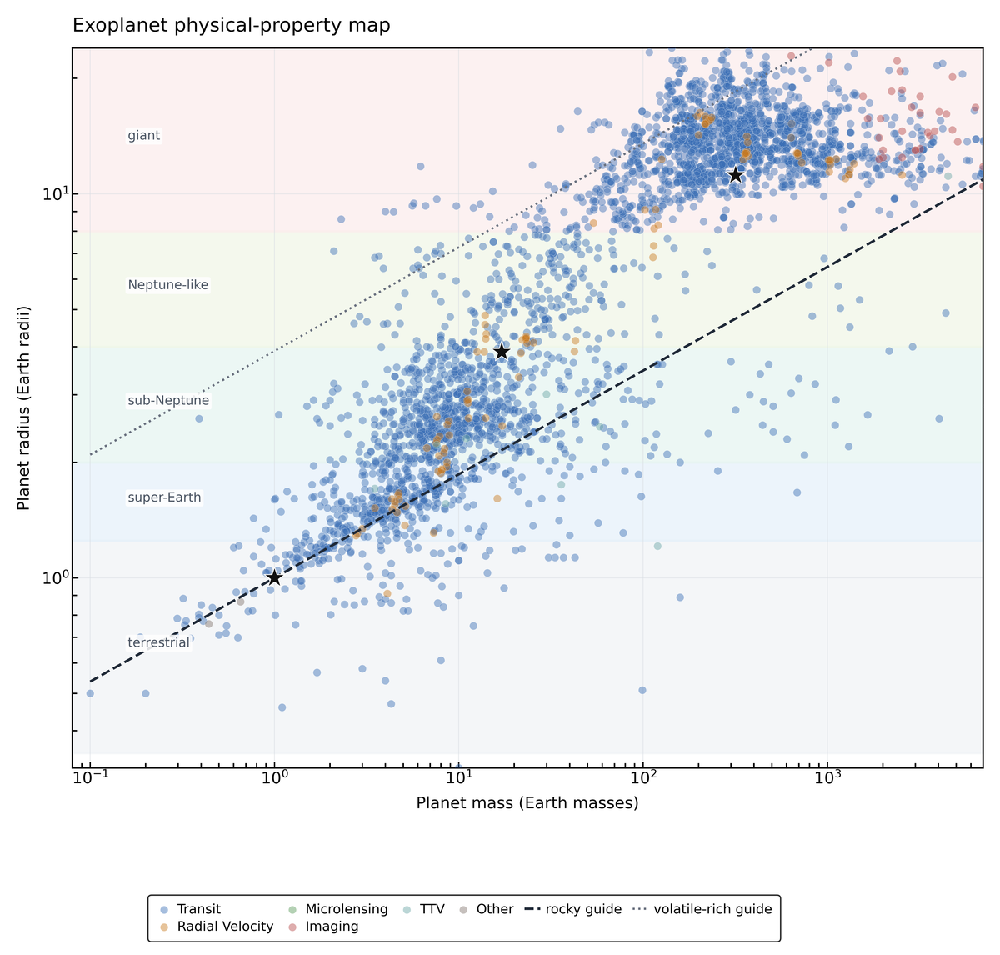

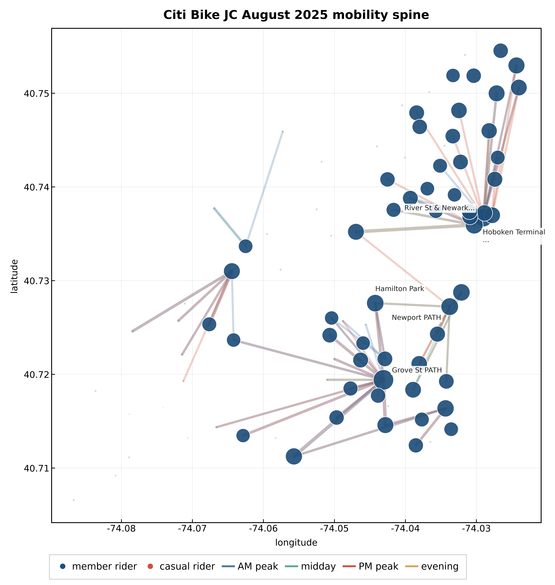
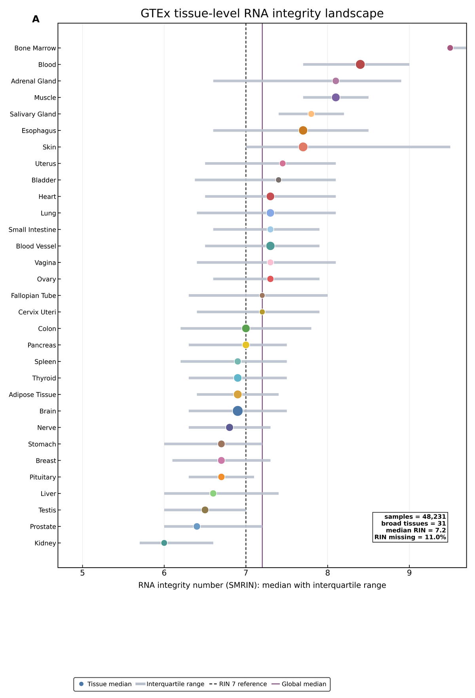

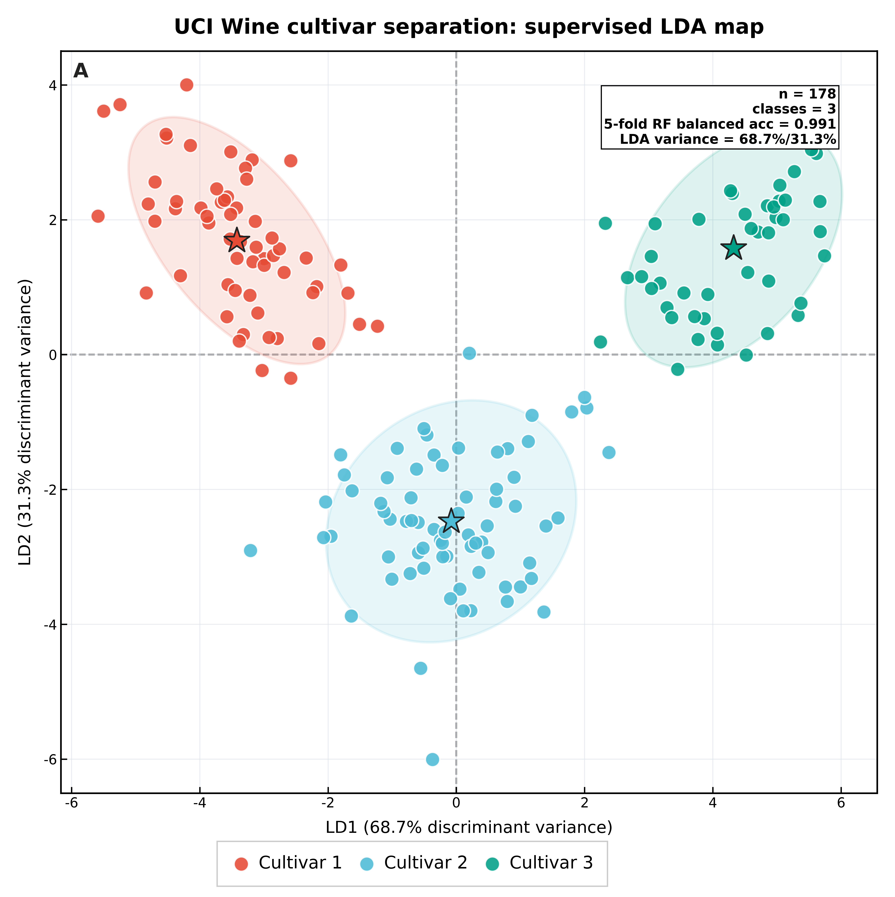

<a id="workflow"></a>

## Workflow

SciFig runs as a Claude Code skill. The entire process is triggered inside a Claude Code conversation — no separate server, no API key, no browser tab.

```
User types trigger keyword or /skill scifig-generate
         │
         ▼
  ┌─────────────────────────────────────────────────────────────────┐
  │  SKILL.md — Coordinator                                         │
  │  Validates file path, reads data, dispatches phases             │
  └───────────────────────────┬─────────────────────────────────────┘
                              │
         ┌────────────────────┼────────────────────┐
         ▼                    ▼                    ▼
   Phase 1              Phase 2              Phase 3
   Data Detection        Chart Planning       Code Generation
   ──────────────        ────────────         ────────────────
   • Validate file       • Recommend chart    • Apply journal
     path + encoding       families by          kernel (font,
   • Infer structure       domain + data        size, layout,
     (tidy/wide/           shape                dpi)
     matrix)             • Plan panel         • Generate
   • Detect domain         blueprint            matplotlib code
     (13 scientific      • Select             • Run finalizer
     domains)              statistical          (3 auto-correct
   • Build dataProfile     tests                passes)
   • Collect             • Build palette      • Layout audit
     preferences           plan               • Legend contract
   • Return:             • Return:            • Return:
     dataProfile           chartPlan            styledCode
         │                    │                    │
         └────────────────────┼────────────────────┘
                              ▼
                        Phase 4
                        Export & Report
                        ────────────────
                        • Export SVG/PDF
                        • Generate source data tables
                        • Render QA evidence
                        • Write methods-ready stats report
                        • Output reproducible code snapshot
                        • Return: outputBundle
```

### How It Works in Practice

**Step 1 — Install**

```bash
git clone https://github.com/Techd81/SciFig.git
cp -r SciFig/.claude/skills/scifig-generate ~/.claude/skills/
```

Restart Claude Code. The skill is auto-discovered.

**Step 2 — Trigger**

In any Claude Code conversation, mention your data file. Trigger keywords: `generate figure`, `plot data`, `sci figure`, `科研图`, `画图`, `多 panel`. Or use the explicit command:

```
> /skill scifig-generate
> FILE: /path/to/your_data.csv
> EXTRAS: I want a hero panel showing biomarker levels over time
```

**Step 3 — Automatic Pipeline**

SciFig takes over from here:

1. **Data Detection** — Reads your file, infers column types, detects the scientific domain, builds a `dataProfile`
2. **Chart Planning** — Recommends chart families (121 types across 13 domains), selects statistical tests, plans panels and palette
3. **Code Generation** — Applies the journal style kernel (Nature / Cell / Science / Lancet / NEJM / JAMA), generates matplotlib code, runs the zero-touch finalizer
4. **Export** — Outputs SVG + PDF figures, source data tables, render QA evidence, stats report, and reproducible code

**Step 4 — Receive Output**

```
output/
├── figures/             # SVG + PDF, vector-only, journal-standard dimensions
├── source_data/         # Excel-ready per-panel tables
├── render_qa/           # Layout audit, contract enforcement, overlap report
├── stats_report.md      # Methods-section-ready test descriptions
├── code/                # Reproducible generator script + helpers snapshot
└── metadata.json        # Provenance, seed, journal profile, palette
```

### What Makes SciFig Different

| Aspect | Traditional workflow | SciFig |
|---|---|---|
| Tool | Python scripts, seaborn docs, Stack Overflow | One Claude Code skill, natural language trigger |
| Chart choice | Browse examples, guess | Auto-recommend by domain + data shape (121 types) |
| Journal style | Hand-tune rcParams per journal | One token swap (`style="nature"` → `"cell"`) |
| Statistics | "Just use a t-test" | Auto-select by data shape; refuse unsupported claims |
| Layout | Manual GridSpec per figure | 11 registry-backed layout recipes + narrative arcs |
| Color | Rainbow palette | Wong / Okabe-Ito defaults, colorblind-safe, cross-panel consistent |
| QA | Render → eyeball → hope | Geometric overlap audit + 3-pass finalizer + render QA |
| CJK | Missing glyph warnings, boxes | Runtime-filtered fallback chain, zero warnings |

## Features

### Charts — 121 Types

| Family | Count | Examples |
|---|---|---|
| Distribution | 14 | `violin_strip`, `raincloud`, `beeswarm`, `ridge`, `ecdf` |
| Time series | 11 | `line_ci`, `spaghetti`, `area_stacked`, `streamgraph`, `gantt` |
| Matrix / heatmap | 11 | `heatmap_cluster`, `heatmap_triangular`, `confusion_matrix`, `dotplot` |
| Scatter / embedding | 10 | `pca`, `umap`, `tsne`, `scatter_regression`, `bland_altman` |
| Statistical diagnostic | 8 | `residual_vs_fitted`, `cook_distance`, `qq`, `leverage_plot` |
| Clinical / survival | 12 | `km`, `forest`, `waterfall`, `swimmer_plot`, `nomogram` |
| Genomics enrichment | 10 | `volcano`, `ma_plot`, `manhattan`, `oncoprint`, `kegg_bar` |
| ML diagnostic | 9 | `roc`, `pr_curve`, `calibration`, `training_curve` |
| Engineering / spectra | 6 | `stress_strain`, `phase_diagram`, `nyquist_plot`, `xrd_pattern` |
| Composition / flow | 12 | `sankey`, `alluvial`, `treemap`, `sunburst`, `chord_diagram` |
| Ecology / environment | 4 | `species_abundance`, `shannon_diversity`, `ordination_plot` |
| Psychology / social | 4 | `likert_divergent`, `likert_stacked`, `mediation_path` |
| Misc / hybrid | 10 | `dumbbell`, `paired_lines`, `dose_response`, `mosaic_plot` |

Full registry: [`phases/code-gen/registry.py`](.claude/skills/scifig-generate/phases/code-gen/registry.py).

### Journal Styles

| Style | Token | Single column | Double column | Typography |
|---|---|---|---|---|
| **Nature** | `style="nature"` | 89 mm | 183 mm | Times New Roman body, 6.5 pt, spine-out ticks |
| **Cell** | `style="cell"` | 85 mm | 174 mm | Denser type, story-board layouts |
| **Science** | `style="science"` | 90 mm | 190 mm | Minimal axes, narrative-first |
| **Lancet** | `style="lancet"` | 84 mm | 174 mm | Clinical conservatism, muted accents |
| **NEJM** | `style="nejm"` | 88 mm | 171 mm | Table-grade hygiene, generous whitespace |
| **JAMA** | `style="jama"` | 89 mm | 183 mm | JAMA Network typography |

### Zero-Touch Finalizer

Three corrective passes run automatically before layout audit — generators don't call these explicitly:

| Pass | What it fixes |
|---|---|
| `_promote_inaxes_text_safety` | Lifts in-axes text to `zorder≥20` + white bbox so labels aren't buried under data |
| `_shrink_heatmap_cell_labels` | Reformats heatmap cell text to fit physical cell width |
| Layout audit | Reports text-vs-line / text-vs-scatter / text-vs-patch overlap > 30% |

Legend contract: exactly one shared bottom-center `fig.legend` per figure. Outside-right legends forbidden by policy.

### CJK Font Fallback

Runtime-filtered fallback chain: `Microsoft YaHei → SimHei → Noto Sans CJK SC → Noto Sans CJK JP → Hiragino Sans → DejaVu Sans`. Only installed families survive. Zero `findfont` warnings.

## Architecture

```
.claude/skills/scifig-generate/
├── SKILL.md                        # Coordinator: gates, agent policy, phase dispatch
├── phases/
│   ├── 01-data-detect.md           # Phase 1: ingest, semantic roles, domain inference
│   ├── 02-recommend-stats.md       # Phase 2: chart taxonomy, stats, panel blueprint
│   ├── 03-code-gen-style.md        # Phase 3: journal profiles, palette, code generation
│   ├── 04-export-report.md         # Phase 4: export bundle, source data, metadata
│   ├── 05-template-distill.md      # Optional article-code extraction
│   └── code-gen/
│       ├── helpers.py              # Finalizer, contracts, layout audit
│       ├── template_mining_helpers.py   # Kernel, palette, idioms
│       ├── registry.py             # 121 chart key → generator function map
│       ├── generators-distribution.py
│       └── generators-multipanel.py
├── specs/                          # Chart catalog, domain playbooks, journal profiles
├── template-mining/                # 7-module visual grammar knowledge base (77 cases)
└── templates/                      # Runtime resources: palette, layout, zorder registries
```

## Contributing

Issues and PRs welcome.

## Development Guidelines

### Commit Messages

Only describe **what changed** (bug fixes, new features). No implementation details, no internal terminology.

```
fix: legend overlapping data in multi-panel figures
feat: add volcano plot generator
fix: heatmap cell labels truncated on small cells
feat: add Lancet journal style profile
```

### Release Notes

Only describe **user-visible changes** (bug fixes, new features). No internal process, no architecture details.

### What NOT to include

- Internal refactoring descriptions
- Architecture or pipeline changes
- Code quality metrics or statistics
- Process or workflow descriptions

## License

MIT — see [LICENSE](LICENSE). Copyright (c) 2026 Techd.

## Acknowledgements

- 77 reference cases extracted from open Nature / Cell / Science / Lancet / NEJM / JAMA figures.
- Color systems credit Bang Wong (Nature Methods 2011) and Masataka Okabe / Kei Ito (J*FLY* 2008).
- Built as a [Claude Code](https://docs.anthropic.com/en/docs/claude-code) skill.

---

<a id="中文"></a>

<details>
<summary><b>中文版</b>（点击展开）</summary>

# SciFig Generate

**在 Claude Code 中把实验数据一步转换为投稿级科研图。**

## 更新日志

- V0.1.0：首次发布。

## 图库

以下所有图均由 SciFig 使用真实开源数据集自动生成，无任何手工后处理。

### 多 Panel 图（11 张）


### 单 Panel Hero 图（6 张）


## 工作流程

SciFig 作为 Claude Code 技能运行，整个流程在 Claude Code 对话中触发——不需要单独的服务器、API 密钥或浏览器标签页。

```
用户输入触发关键词或 /skill scifig-generate
         │
         ▼
  ┌───────────────────────────────────────────────────┐
  │  SKILL.md — 协调器                                  │
  │  验证文件路径、读取数据、分派各阶段                     │
  └─────────────────────┬─────────────────────────────┘
                        │
       ┌────────────────┼────────────────┐
       ▼                ▼                ▼
  阶段 1            阶段 2            阶段 3
  数据检测           图表规划           代码生成
  ────────          ────────          ────────
  • 验证文件路径     • 按领域和数据     • 应用期刊样式
    和编码            形态推荐图表       内核（字体、
  • 推断数据结构       家族（121 种       尺寸、布局、
    （tidy/wide/       图表，13 个        DPI）
    matrix）           领域）           • 生成 matplotlib
  • 检测科学领域     • 规划 panel         代码
    （13 个领域）      布局蓝图         • 运行 finalizer
  • 构建 dataProfile • 选择统计检验     • 布局审计
  • 收集偏好         • 构建调色板方案   • 图例合约
  • 输出：           • 输出：           • 输出：
    dataProfile       chartPlan         styledCode
       │                │                │
       └────────────────┼────────────────┘
                        ▼
                  阶段 4
                  导出与报告
                  ────────
                  • 导出 SVG/PDF
                  • 生成源数据表格
                  • 渲染 QA 证据
                  • 撰写统计报告
                  • 输出可复现代码快照
                  • 输出：outputBundle
```

### 实际使用步骤

**第 1 步 — 安装**

```bash
git clone https://github.com/Techd81/SciFig.git
cp -r SciFig/.claude/skills/scifig-generate ~/.claude/skills/
```

重启 Claude Code，技能自动被发现。

**第 2 步 — 触发**

在任意 Claude Code 对话中提及你的数据文件。触发关键词：`生成图表`、`画图`、`科研图`、`多 panel`、`generate figure`、`plot data`。或使用显式命令：

```
> /skill scifig-generate
> FILE: /path/to/your_data.csv
> EXTRAS: 我想要一个 hero panel 显示生物标志物随时间的变化
```

**第 3 步 — 自动流水线**

SciFig 自动执行：

1. **数据检测** — 读取文件、推断列类型、检测科学领域、构建 `dataProfile`
2. **图表规划** — 推荐图表家族（13 个领域 121 种）、选择统计检验、规划面板和调色板
3. **代码生成** — 应用期刊样式内核（Nature / Cell / Science / Lancet / NEJM / JAMA）、生成 matplotlib 代码、运行 zero-touch finalizer
4. **导出** — 输出 SVG + PDF 图、源数据表、渲染 QA 证据、统计报告、可复现代码

**第 4 步 — 获得输出**

```
output/
├── figures/             # SVG + PDF，纯矢量，期刊标准尺寸
├── source_data/         # 每个 panel 的 Excel-ready 表格
├── render_qa/           # 布局审计 + 合约执行 + 重叠报告
├── stats_report.md      # 论文方法学就绪的统计描述
├── code/                # 可复现生成脚本 + helpers 快照
└── metadata.json        # 来源、随机种子、期刊配置、调色板
```

### SciFig 与传统方式的区别

| 方面 | 传统方式 | SciFig |
|---|---|---|
| 工具 | Python 脚本、seaborn 文档、Stack Overflow | 一个 Claude Code 技能，自然语言触发 |
| 图表选择 | 翻文档、靠猜 | 按领域 + 数据形态自动推荐（121 种） |
| 期刊样式 | 每次投稿手工调 rcParams | 一个 token 切换（`style="nature"` → `"cell"`） |
| 统计 | "随便加一个 t 检验" | 按数据形态自动选检验，拒绝不支持的推断 |
| 排版 | 每图手写 GridSpec | 11 种 layout 配方 + 叙事弧 |
| 配色 | 彩虹色 | Wong / Okabe-Ito 默认，色盲安全，跨 panel 一致 |
| 质检 | 渲染 → 肉眼看 → 希望 | 几何重叠审计 + 3 pass finalizer + 渲染 QA |
| 中文 | 缺字形警告、方块字 | 运行时过滤回退链，零警告 |

## 核心特性

- **121 种投稿级图表**：13 个科研领域，每种都有专用生成函数
- **6 种期刊样式**：Nature / Cell / Science / Lancet / NEJM / JAMA，一行切换
- **77 案例视觉语法知识库**：rcParams kernel、zorder recipes、14 调色板、12 layout 配方
- **Finalizer 零修改自动校正**：3 pass（文本安全提升 + 热图标签适配 + 布局审计）
- **CJK 字体回退**：Windows / Linux / macOS 自动选用，运行时过滤零警告

## 开发规范

### Commit 信息

只描述**改了什么**（修复 bug、新增功能），不写实现细节和内部术语。

```
fix: 多 panel 图中图例遮挡数据
feat: 新增火山图生成器
fix: 热图 cell 标签在小单元格中被截断
feat: 新增 Lancet 期刊样式配置
```

### Release 说明

只描述**用户可见的变化**（修复 bug、新增功能），不写内部过程和架构细节。

### 不要包含的内容

- 内部重构描述
- 架构或流水线变更
- 代码质量指标或统计
- 过程或工作流描述

## 许可

MIT，详见 [LICENSE](LICENSE)。版权 (c) 2026 Techd。

</details>
