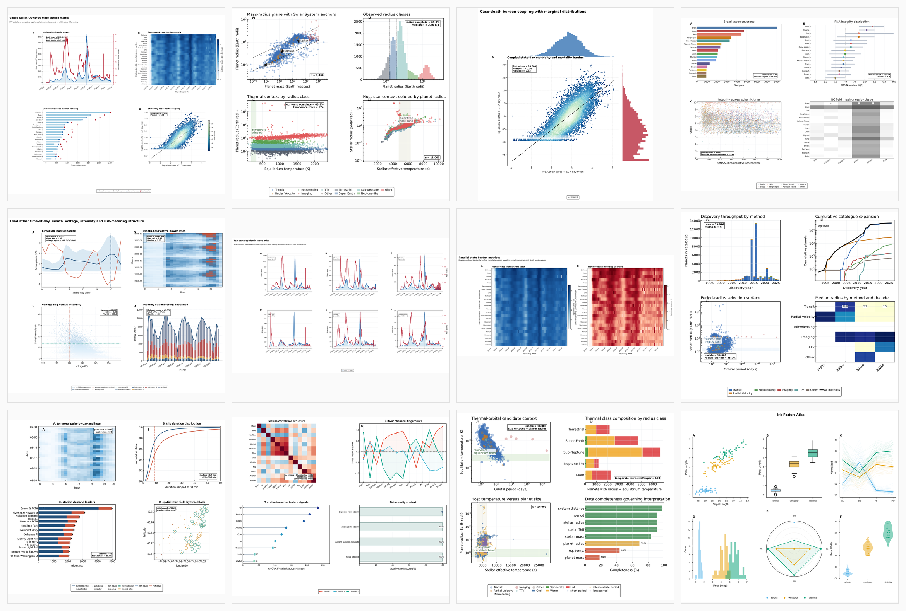
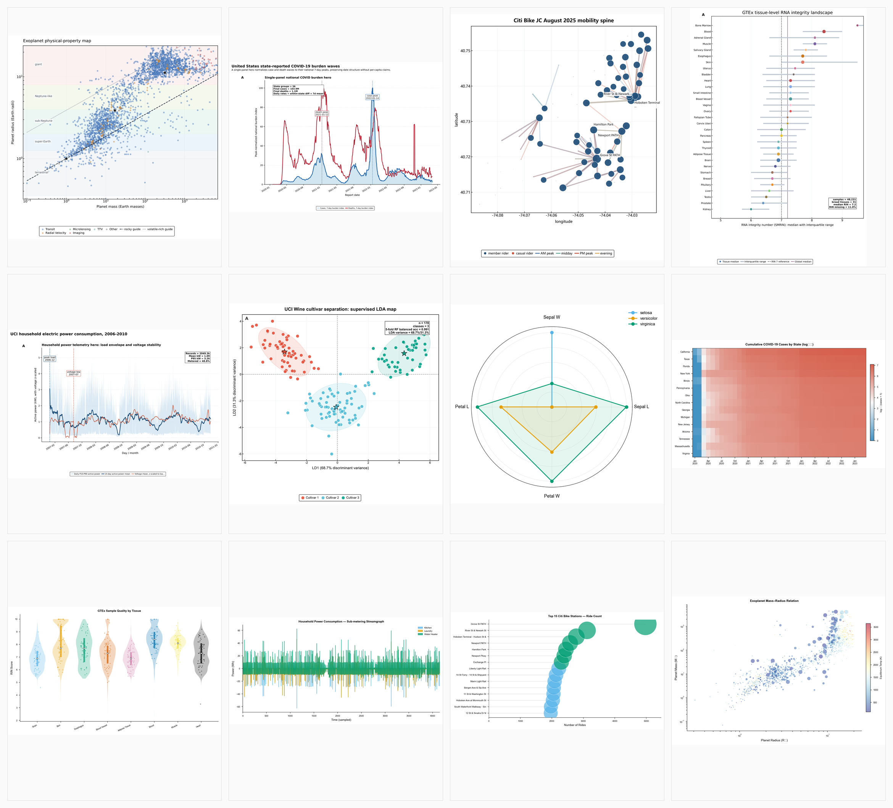

<div align="center">

# SciFig Generate

**Turn experimental data into publication-ready scientific figures — directly inside Claude Code.**

[](LICENSE)
[](https://www.python.org/downloads/)
[](#charts)
[](#journal-styles)

[English](#english) · [中文](#中文) · [Gallery](#gallery) · [Workflow](#workflow) · [Quick Start](#quick-start)

</div>

---

`<a id="english"></a>`

## What It Is

SciFig Generate is a [Claude Code](https://docs.anthropic.com/en/docs/claude-code) skill that transforms experimental data — CSV, TSV, Excel, or matrix files — into submission-ready scientific figures.

Drop the skill into Claude Code, mention your data file, and let the four-phase pipeline handle ingestion, chart planning, statistical-test selection, journal-styled code generation, and export.

The skill is self-contained: 121-chart registry, six journal-style profiles (Nature / Cell / Science / Lancet / NEJM / JAMA), zero-touch finalizer (legend contract, layout audit, heatmap label sizing, text-occlusion guards), and SVG / PDF / PNG export with source data, render-QA evidence, and methods-ready statistical reports. No pip install required.

## Changelog

- V0.3.0: Skill-only repository — removed pip package (`src/`), release scripts (`scripts/`), tests, and PyPI/CLI docs. All runtime behavior lives in `scifig/`.
- V0.2.1: Refactored the scifig skill — split the 8341-line `generators-distribution.md` monolith into 13 legal domain-split `generators_<domain>.py` modules; slimmed `case-index.json` by moving bulk evidence into gitignored `case-evidence.json`; Phase 3 now injects generator source on-demand via `_build_generator_code`.
- V0.1.2: Add editable SVG output with matching PNG regeneration.
- V0.1.1: Fix gallery style consistency for centered titles, compact bottom legends, outside panel labels, and ASCII-safe scientific labels.
- V0.1.0: Initial release.

`<a id="gallery"></a>`

## Gallery

All figures below were generated by SciFig from real open-source datasets across 6 scientific domains. No manual post-processing.

### Multi-Panel Figures



### Single-Panel Hero Figures



`<a id="workflow"></a>`

## Workflow

SciFig runs as a Claude Code skill. The entire process is triggered inside a Claude Code conversation — no separate server, no API key, no browser tab.

```
User types trigger keyword or /skill scifig
         │
         ▼
  ┌─────────────────────────────────────────────────────────────────┐
  │  SKILL.md — Coordinator                                         │
  │  Validates file path, reads data, dispatches phases             │
  └───────────────────────────┬─────────────────────────────────────┘
                              │
         ┌────────────────────┼────────────────────┐
         ▼                    ▼                    ▼
   Phase 1              Phase 2              Phase 3
   Data Detection        Chart Planning       Code Generation
   ──────────────        ────────────         ────────────────
   • Validate file       • Recommend chart    • Apply journal
     path + encoding       families by          kernel (font,
   • Infer structure       domain + data        size, layout,
     (tidy/wide/           shape                dpi)
     matrix)             • Plan panel         • Generate
   • Detect domain         blueprint            matplotlib code
     (13 scientific      • Select             • Run finalizer
     domains)              statistical          (3 auto-correct
   • Build dataProfile     tests                passes)
   • Collect             • Build palette      • Layout audit
     preferences           plan               • Legend contract
   • Return:             • Return:            • Return:
     dataProfile           chartPlan            styledCode
         │                    │                    │
         └────────────────────┼────────────────────┘
                              ▼
                        Phase 4
                        Export & Report
                        ────────────────
                        • Export SVG/PDF
                        • Generate source data tables
                        • Render QA evidence
                        • Write methods-ready stats report
                        • Output reproducible code snapshot
                        • Return: outputBundle
```

`<a id="quick-start"></a>`

### How It Works in Practice

**Step 1 — Install**

```bash
git clone https://github.com/Techd81/SciFig.git
cp -r SciFig/scifig ~/.claude/skills/
```

Restart Claude Code. The skill is auto-discovered.

**Step 2 — Trigger**

In any Claude Code conversation, mention your data file. Trigger keywords: `generate figure`, `plot data`, `sci figure`, `科研图`, `画图`, `多 panel`. Or use the explicit command:

```
> /skill scifig
> FILE: /path/to/your_data.csv
> EXTRAS: I want a hero panel showing biomarker levels over time
```

**Step 3 — Automatic Pipeline**

SciFig takes over from here:

1. **Data Detection** — Reads your file, infers column types, detects the scientific domain, builds a `dataProfile`
2. **Chart Planning** — Recommends chart families (121 types across 13 domains), selects statistical tests, plans panels and palette
3. **Code Generation** — Applies the journal style kernel (Nature / Cell / Science / Lancet / NEJM / JAMA), generates matplotlib code, runs the zero-touch finalizer
4. **Export** — Outputs SVG + PDF figures, source data tables, render QA evidence, stats report, and reproducible code

**Step 4 — Receive Output**

```
output/
├── figures/             # SVG + PDF, vector-only, journal-standard dimensions
├── source_data/         # Excel-ready per-panel tables
├── render_qa/           # Layout audit, contract enforcement, overlap report
├── stats_report.md      # Methods-section-ready test descriptions
├── code/                # Reproducible generator script + helpers snapshot
└── metadata.json        # Provenance, seed, journal profile, palette
```

### What Makes SciFig Different

| Aspect        | Traditional workflow                                   | SciFig                                              |
| ------------- | ------------------------------------------------------ | --------------------------------------------------- |
| Tool          | Python scripts, seaborn docs, Stack Overflow           | One Claude Code skill, natural language trigger     |
| Chart choice  | Browse examples, guess                                 | Auto-recommend by domain + data shape (121 types)   |
| Journal style | Hand-tune rcParams per journal                         | One token swap (`style="nature"` → `"cell"`)        |
| Statistics    | "Just use a t-test"                                    | Auto-select by data shape; refuse unsupported claims |
| Layout        | Manual GridSpec per figure                             | 11 registry-backed layout recipes + narrative arcs  |
| Color         | Rainbow palette                                        | Wong / Okabe-Ito defaults, colorblind-safe          |
| QA            | Render → eyeball → hope                                | Geometric overlap audit + 3-pass finalizer        |
| Manual fixes  | Drag labels after exporting, then lose reproducibility | Editable SVG is the canonical source                |
| CJK           | Missing glyph warnings, boxes                          | Runtime-filtered fallback chain, zero warnings      |

## Features

### Charts — 121 Types

| Family                 | Count | Examples                                                                       |
| ---------------------- | ----- | ------------------------------------------------------------------------------ |
| Distribution           | 14    | `violin_strip`, `raincloud`, `beeswarm`, `ridge`, `ecdf`                       |
| Time series            | 11    | `line_ci`, `spaghetti`, `area_stacked`, `streamgraph`, `gantt`                |
| Matrix / heatmap       | 11    | `heatmap_cluster`, `heatmap_triangular`, `confusion_matrix`, `dotplot`         |
| Scatter / embedding    | 10    | `pca`, `umap`, `tsne`, `scatter_regression`, `bland_altman`                    |
| Statistical diagnostic | 8     | `residual_vs_fitted`, `cook_distance`, `qq`, `leverage_plot`                   |
| Clinical / survival    | 12    | `km`, `forest`, `waterfall`, `swimmer_plot`, `nomogram`                        |
| Genomics enrichment    | 10    | `volcano`, `ma_plot`, `manhattan`, `oncoprint`, `kegg_bar`                     |
| ML diagnostic          | 9     | `roc`, `pr_curve`, `calibration`, `training_curve`                             |
| Engineering / spectra  | 6     | `stress_strain`, `phase_diagram`, `nyquist_plot`, `xrd_pattern`                |
| Composition / flow     | 12    | `sankey`, `alluvial`, `treemap`, `sunburst`, `chord_diagram`                   |
| Ecology / environment  | 4     | `species_abundance`, `shannon_diversity`, `ordination_plot`                  |
| Psychology / social    | 4     | `likert_divergent`, `likert_stacked`, `mediation_path`                         |
| Misc / hybrid          | 10    | `dumbbell`, `paired_lines`, `dose_response`, `mosaic_plot`                     |

Full registry: [`runtime/registry.py`](scifig/runtime/registry.py).

`<a id="journal-styles"></a>`

### Journal Styles

| Style             | Token               | Single column | Double column | Typography                                    |
| ----------------- | ------------------- | ------------- | ------------- | --------------------------------------------- |
| **Nature**  | `style="nature"`  | 89 mm         | 183 mm        | Times New Roman body, 6.5 pt, spine-out ticks |
| **Cell**    | `style="cell"`    | 85 mm         | 174 mm        | Denser type, story-board layouts              |
| **Science** | `style="science"` | 90 mm         | 190 mm        | Minimal axes, narrative-first                 |
| **Lancet**  | `style="lancet"`  | 84 mm         | 174 mm        | Clinical conservatism, muted accents          |
| **NEJM**    | `style="nejm"`    | 88 mm         | 171 mm        | Table-grade hygiene, generous whitespace      |
| **JAMA**    | `style="jama"`    | 89 mm         | 183 mm        | JAMA Network typography                       |

### Zero-Touch Finalizer

Three corrective passes run automatically before layout audit — generators don't call these explicitly:

| Pass                            | What it fixes                                                                        |
| ------------------------------- | ------------------------------------------------------------------------------------ |
| `_promote_inaxes_text_safety` | Lifts in-axes text to `zorder≥20` + white bbox so labels aren't buried under data    |
| `_shrink_heatmap_cell_labels` | Reformats heatmap cell text to fit physical cell width                               |
| Layout audit                    | Reports text-vs-line / text-vs-scatter / text-vs-patch overlap > 30%                 |

Legend contract: exactly one shared bottom-center `fig.legend` per figure. Outside-right legends and in-axes `loc="best"` are forbidden by policy and enforced by `source-lint.py`.

### CJK Font Fallback

Runtime-filtered fallback chain: `DejaVu Sans → Arial → Helvetica → Microsoft YaHei → SimHei → Noto Sans CJK SC → Noto Sans CJK JP → Hiragino Sans`. Only installed families survive. Zero `findfont` warnings.

## Architecture

```
SciFig/
├── scifig/        # Claude Code / Cursor skill (entire runtime)
│   ├── SKILL.md                           # Coordinator: gates, phase dispatch
│   ├── reference/                         # Progressive disclosure (coordinator details)
│   ├── phases/
│   │   ├── 01-data-detect.md              # Phase 1: ingest, domain inference
│   │   ├── 02-recommend-stats.md          # Phase 2: chart taxonomy, stats, blueprint
│   │   ├── 03-code-gen-style.md           # Phase 3: journal profiles, code generation
│   │   ├── 04-export-report.md            # Phase 4: export bundle, metadata
│   │   └── 05-template-distill.md         # Optional article-code extraction
│   ├── runtime/
│   │   ├── helpers.py                     # Finalizer, contracts, layout audit
│   │   ├── template_mining_helpers.py     # Kernel, palette, idioms
│   │   ├── registry.py                    # 121 chart key → generator map
│   │   ├── source-lint.py                 # Forbidden-pattern lint
│   │   └── generators_*.py                # Domain-grouped implementations
│   ├── specs/                             # Chart catalog, playbooks, policies
│   ├── knowledge/                         # Visual grammar (modules + techniques)
│   ├── resources/                         # Palette, layout, zorder JSON registries
│   └── assets/fonts/                      # Optional user-supplied fonts
├── .cursor/skills/scifig/                 # Cursor project skill (junction → scifig/)
└── docs/gallery/                          # README gallery images
```

## Contributing

Issues and PRs welcome. Committable skill work stays under `scifig/`.

## License

MIT — see [LICENSE](LICENSE). Copyright (c) 2026 Techd.

## Acknowledgements

- 94 reference cases extracted from the local `template/` corpus, including open Nature / Cell / Science / Lancet / NEJM / JAMA-style figures.
- Color systems credit Bang Wong (Nature Methods 2011) and Masataka Okabe / Kei Ito (J*FLY* 2008).
- Built as a [Claude Code](https://docs.anthropic.com/en/docs/claude-code) skill.

---

`<a id="中文"></a>`

<details>
<summary><b>中文版</b>（点击展开）</summary>

# SciFig Generate

**在 Claude Code 中把实验数据一步转换为投稿级科研图。**

## 项目简介

SciFig Generate 是一个 [Claude Code](https://docs.anthropic.com/en/docs/claude-code) 技能，可将实验数据（CSV、TSV、Excel 或矩阵文件）转换为投稿级科研图。

把技能放进 Claude Code，对话中提到数据文件即可，由四阶段流水线自动完成数据读取、图表规划、统计检验选择、期刊样式代码生成与导出。无需 pip 安装，所有运行时代码都在 `scifig/` 内。

## 更新日志

- V0.3.0：纯 skill 仓库 — 移除 pip 包（`src/`）、发版脚本（`scripts/`）、测试和 PyPI/CLI 文档。
- V0.2.1：重构 scifig 技能 — 将 8341 行 `generators-distribution.md` 拆分为 13 个 `generators_<domain>.py` 模块；`case-index.json` 瘦身，bulk evidence 移入 gitignored `case-evidence.json`。
- V0.1.2：新增可编辑 SVG 输出，并从 SVG 重新生成一致的 PNG。
- V0.1.1：修复图库样式一致性问题。
- V0.1.0：首次发布。

## 图库

以下所有图均由 SciFig 使用真实开源数据集自动生成，无任何手工后处理。

### 多 Panel 图


### 单 Panel Hero 图


## 工作流程

SciFig 作为 Claude Code 技能运行，整个流程在 Claude Code 对话中触发——不需要单独的服务器、API 密钥或浏览器标签页。

```
用户输入触发关键词或 /skill scifig
         │
         ▼
  ┌───────────────────────────────────────────────────┐
  │  SKILL.md — 协调器                                  │
  │  验证文件路径、读取数据、分派各阶段                     │
  └─────────────────────┬─────────────────────────────┘
                        │
       ┌────────────────┼────────────────┐
       ▼                ▼                ▼
  阶段 1            阶段 2            阶段 3
  数据检测           图表规划           代码生成
  ────────          ────────          ────────
  • 验证文件路径     • 按领域和数据     • 应用期刊样式
    和编码            形态推荐图表       内核
  • 推断数据结构       家族（121 种）    • 生成 matplotlib
  • 检测科学领域     • 规划 panel         代码
  • 构建 dataProfile   布局蓝图         • 运行 finalizer
  • 输出：           • 输出：           • 输出：
    dataProfile       chartPlan         styledCode
       │                │                │
       └────────────────┼────────────────┘
                        ▼
                  阶段 4
                  导出与报告
```

### 实际使用步骤

**第 1 步 — 安装**

```bash
git clone https://github.com/Techd81/SciFig.git
cp -r SciFig/scifig ~/.claude/skills/
```

重启 Claude Code，技能自动被发现。

**第 2 步 — 触发**

触发关键词：`生成图表`、`画图`、`科研图`、`多 panel`、`generate figure`、`plot data`。或使用：

```
> /skill scifig
> FILE: /path/to/your_data.csv
> EXTRAS: 我想要一个 hero panel 显示生物标志物随时间的变化
```

**第 3 步 — 获得输出**

```
output/
├── figures/             # SVG + PDF
├── source_data/         # 每个 panel 的 Excel-ready 表格
├── render_qa/           # 布局审计 + 合约执行
├── stats_report.md      # 方法学就绪的统计描述
├── code/                # 可复现生成脚本
└── metadata.json        # 来源、种子、期刊配置
```

### SciFig 与传统方式的区别

| 方面     | 传统方式                                  | SciFig                                    |
| -------- | ----------------------------------------- | ----------------------------------------- |
| 工具     | Python 脚本、seaborn 文档、Stack Overflow | 一个 Claude Code 技能，自然语言触发       |
| 图表选择 | 翻文档、靠猜                              | 按领域 + 数据形态自动推荐（121 种）       |
| 期刊样式 | 每次投稿手工调 rcParams                   | 一个 token 切换                           |
| 统计     | "随便加一个 t 检验"                       | 按数据形态自动选检验                      |
| 质检     | 渲染 → 肉眼看 → 希望                    | 几何重叠审计 + 3 pass finalizer           |

## 架构

```
SciFig/
├── scifig/        # Claude Code 技能（全部运行时代码）
│   ├── SKILL.md
│   ├── phases/             # 四阶段流水线 + code-gen/
│   ├── specs/              # 图表目录、领域 playbook、期刊样式
│   ├── runtime/            # Python 生成器与 finalizer
│   ├── knowledge/          # 视觉语法知识库（94 案例）
│   └── resources/          # palette、layout、zorder 注册表
└── docs/gallery/           # README 图库图片
```

## 贡献

欢迎 Issue 与 PR。可提交的 skill 改动请放在 `scifig/` 下。

## 许可

MIT，详见 [LICENSE](LICENSE)。版权 (c) 2026 Techd。

## 致谢

- 94 个参考案例来自本地 `template/` 语料库。
- 配色系统来自 Bang Wong（Nature Methods 2011）与 Masataka Okabe / Kei Ito（J*FLY* 2008）。
- 作为 [Claude Code](https://docs.anthropic.com/en/docs/claude-code) 技能构建。

</details>
